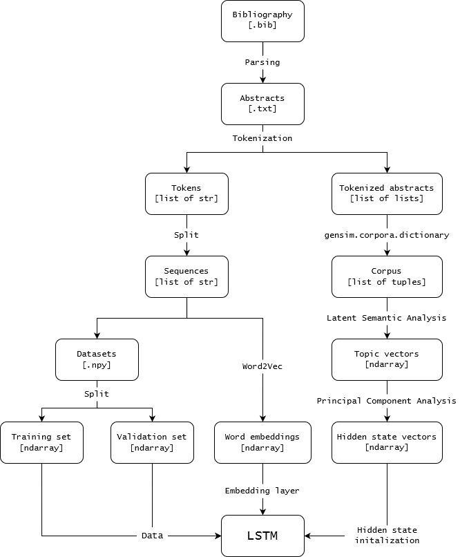
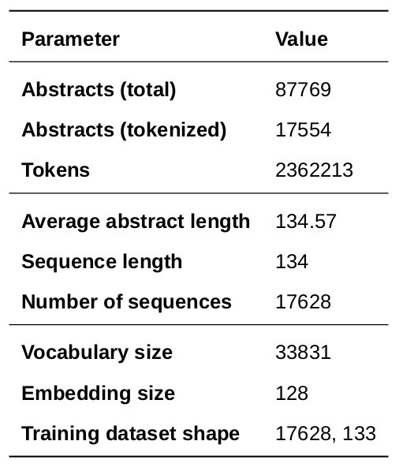
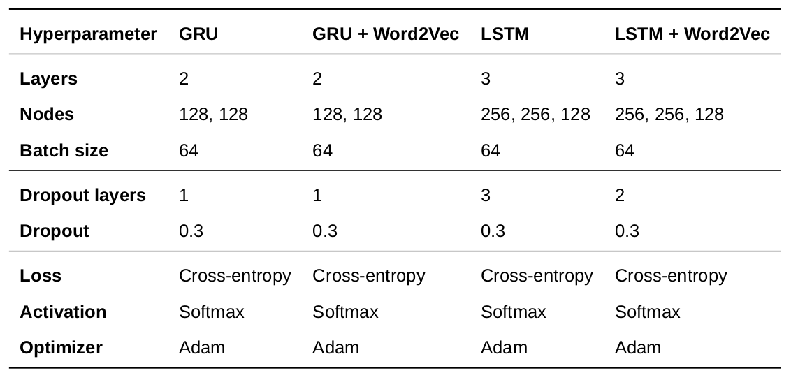
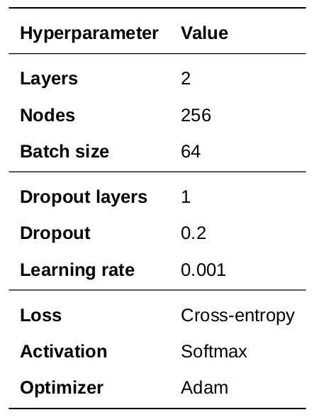

# NLP Paper Abstract Generator

Individual Project - ULC MSc Computer Science 2020/21

## Abstract

Despite increased access to scientific literature, generating strong research hypotheses remains a
challenging task. 

This project aims to generate synthetic abstracts from an input bibliography with
the aim to support researchers in finding promising directions for future work.

The proposed approach comprises an LSTM trained on 20% of the ACL literature of the past
five years and conditioned on a topic representation of the same corpus constructed using LSA.

Text of desired length is then generated using top k sampling following an input prompt.

The proposed model is evaluated using validation perplexity against four comparable word-level
RNNs (GRU and LSTM with and without Word2Vec embeddings).

Results show a significant improvement in both perplexity scores and quality of the generation
compared to the baseline LSTM models, with the proposed architecture with Word2Vec embeddings
outperforming the standard LSTM + Word2Vec baseline 158.50 to 306.43.

## System



*Figure 1: Visual overview of the system*

The text generation system is composed of several sequential steps grouped in four Jupyter notebooks.

A brief walkthrough of each notebook is provided below.

### [1. Download](notebooks/download.ipynb) 

Downloads the ACL anthology abstracts directly from the source and saves it in the `data` folder.

### [2. Preprocess](notebooks/preprocess.ipynb)

#### 2.1 Tokens

20% of the abstracts published after 2015 are converted into a `.txt` file and then tokenised. 

```
['we',
 'present',
 'a',
 'scaffolded',
 'discovery',
 'learning',
 'approach',
 'to',
 'introducing',
 'concepts',
 'in',
 'a',
 'natural',
 'language',
 'processing',]
```
*Example: Tokenized abstract output*

#### 2.2 Sequences

The average abstract has roughly `134` tokens. This is then been used as the sequence length to create sequences needed to train our `Word2Vec` word embeddings. 

#### 2.3 Word embeddings

After training for `100` epochs, our final embedded vocabulary size is `33831`.

#### 2.4 Datasets



*Table 1: Preprocessed dataset statistics* 

The preprocessed dataset is then split 80/20 in `training` and `validation` sets.

### [3. Baselines](notebooks/baselines.ipynb)

Models used for benchmarking are:

1. GRU
2. GRU + Word2Vec
3. LSTM
4. LSTM + Word2Vec

The models are constructed using Tensorflow / Keras and evaluated using perplexity scores.



*Table 2: Baseline models hyperparameters*

### [4. Model](notebooks/model.ipynb)

In order to build our conditioned model, we use a reduced version of the tokenized dictionary to train an `LSA` in order to extract topic information from the dataset and create their vector representation.

After being properly
dimensioned using `PCA`, the topic matrix is then used to initialize the hidden and cell states of our `LSTM` models (with and without `Word2Vec` embeddings).



*Table 3: Conditioned models hyperparameters*

Finally, after prompting input text, `k sampling` is used to retrieve the k
most likely next words and sample from them, iteratively adding words to the generated text up to
a desired length.

## Future work

Despite the encouraging results, the approach still suffers from several shortcomings. 

The most
prominent one is the problem of "vanishing conditioning", in particular for long sequences. Since it
is only applied at the beginning of the batch, the topic vectors are unlikely to meaningfully affect
generation after a certain point. A potential solution would involve training on joint couples of
abstracts (with the second strictly more recent than the first). 

Another area of improvement is
topic representation, with LSA generally not being able to handle multiple meaning and non-linear
dependencies. Additionally, both word representation and dimensionality reduction techniques
could be improved upon the crude ones used in this work.

Finally, on the evaluation side, the lack of human evaluation of the outputs and the reliance on
a single quantitative metric limit the robustness of the evaluation.

## Reproducibility

A list of the Python packages used and their versions can be found at [`requirements.txt`](requirements.txt) and below.

```
gensim==4.0.1
matplotlib==3.2.2
nltk==3.6.2
numpy==1.19.1
pybtex==0.24.0
requests==2.25.1
scikit-learn==0.24.2
tensorflow==2.1.0
pytorch==1.3.1
```